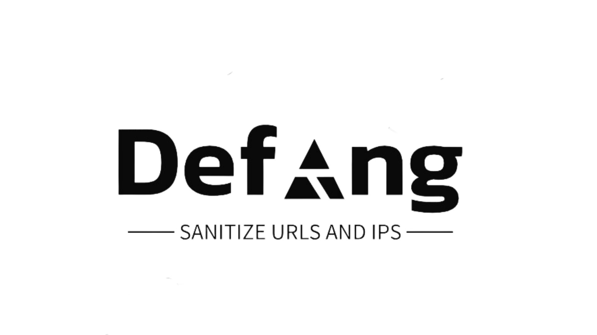

# Defang Extension

## Overview

The Defang Extension enhances your web browsing by automatically defanging IP addresses and URLs, making interactions secure and enabling effortless inclusion of these links in reports or for sharing.

## Features

**Automatic Defanging:** When you select text that appears to be an IP address or URL, the extension will automatically defang it by replacing certain characters, such as dots and slashes, with safe alternatives.

**Clipboard Copy:** The defanged text is automatically copied to your clipboard for easy pasting into emails, documents, or other applications.

**Simplified User Interface:** The extension keeps the user interface simple and unobtrusive, focusing on enhancing your browsing experience without unnecessary distractions.

## Installation

**Supported Browsers**
 1. Google Chrome 
 2. Mozilla Firefox  (Coming Soon)
 3. Microsoft Edge  (Coming Soon)

## Installation Steps

 
### Installation

#### Google Chrome (Developer Mode)

1.  **Download the Extension**:
    
    -   Visit the [GitHub Repository]([https://github.com/your-username/defang-extension](https://github.com/ashizZz/Defang/tree/main)).
    -   Click the "Code" button and select "Download ZIP" to download the extension's ZIP file.
2.  **Install in Developer Mode**:
    
    -   Extract the downloaded ZIP file to a folder on your computer.
    -   Open your Google Chrome browser.
    -   Go to `chrome://extensions/`.
    -   Enable "Developer mode" in the top-right corner of the extensions page.
    -   Click the "Load unpacked" button.
    -   Select the folder where you extracted the extension files and click "Open."
3.  **Usage**:
    
    -   The extension runs automatically in the background. Simply select any text that appears to be an IP address or URL, and the extension will defang it for you while also automatically copying it to the clipboard.
      
 

 

#### Web Store (Coming Soon)

We are also in the process of publishing the extension on official web stores. Once available, you will be able to install the Defang Extension directly from your browser's web store.

## Contributing

We welcome contributions from the open-source community! If you want to contribute to the Defang Extension, please follow these steps:

1.  Fork the repository to your own GitHub account.
2.  Clone the forked repository to your local machine.
3.  Create a new branch for your feature or bug fix: `git checkout -b feature/your-feature-name` or `git checkout -b bugfix/your-bug-fix-name`.
4.  Make your changes and commit them with clear and concise messages.
5.  Push your changes to your forked repository: `git push origin feature/your-feature-name`.
6.  Create a pull request (PR) to the original repository, describing your changes and their purpose.

